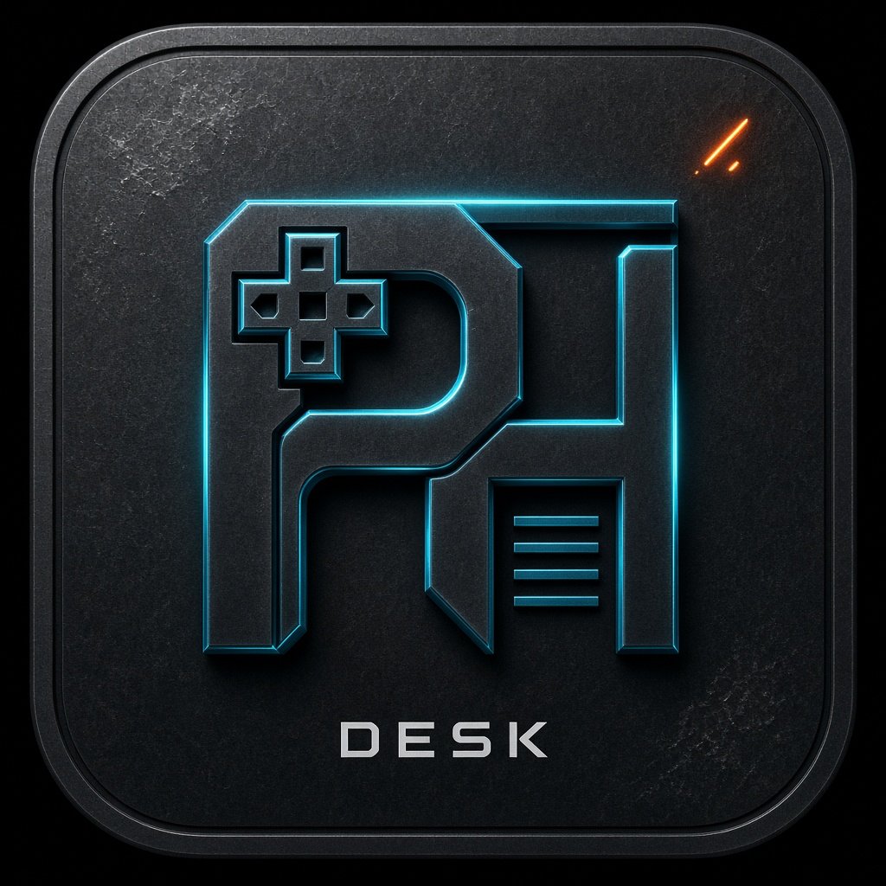

# PS Homebrew Desk

<p align="center">
  
</p>

<p align="center"><strong>by Pixam</strong></p>

Companion **Mac / Windows / iPhone (PWA)** pour installer facilement des `.elf` / tools sur une PS5 jailbreakée, via le FTP etaHEN/OnionHEN.

> **Distribution publique** : vois [`RELEASE.md`](RELEASE.md) — publie le **build Windows `.exe`**, pas forcément tout le code source.

> **Avant un usage LAN public / multi-appareils** : définis `DESK_TOKEN=...` — sans token, n’importe qui sur le Wi‑Fi de confiance peut piloter les APIs mutantes du hub.

## Plateformes

| Appareil | Comment lancer |
|---|---|
| **Mac** | `python3 desktop.py` ou `start.command` |
| **Windows** | `start.bat` (Python 3 + [WebView2](https://developer.microsoft.com/microsoft-edge/webview2/)) |
| **iPhone / autre PC** | Sur le hub : `start-lan.command` / `start-lan.bat`, puis Safari/Chrome → URL LAN |

L’UI est une web app servie en local. Le mode LAN expose la même UI sur le Wi‑Fi → iPhone peut l’ouvrir et l’ajouter à l’écran d’accueil (PWA).

## Lancer

```bash
cd pshomebrew-desk
python3 -m pip install --user -r requirements.txt
python3 desktop.py
```

Mode navigateur :

```bash
python3 app.py
# http://127.0.0.1:8787
```

### Mode LAN (mises à jour + iPhone + Windows distant)

```bash
# Mac
./start-lan.command

# Windows
start-lan.bat

# ou
DESK_LAN=1 DESK_HOST=0.0.0.0 python3 desktop.py
```

Optionnel : `DESK_TOKEN=secret` → les clients LAN doivent envoyer le header `X-PSHD-Token` (stockable dans le navigateur via `localStorage.pshd-token`).

Dans l’onglet **Desk → Réseau & mises à jour** :
- copie l’URL LAN
- **Publier une mise à jour LAN**
- les autres appareils téléchargent `/updates/latest.zip`

CLI :

```bash
python3 scripts/publish_update.py "notes de version"
# sur un autre appareil qui a déjà une copie du projet :
python3 scripts/apply_update.py http://IP_DU_HUB:8787/updates/latest.zip
```

## Ce que ça fait

- Scan rapide des ports (1337 / 9021 / 9120 / 9048)
- Explorateur : écriture sur **`/data`**, **`/user`**, **`/mnt`** ; système en lecture seule
- Store local (`catalog/default.json`) + SHA-256
- Transfert FTP parallèle, liens → console (RAR/ZIP/7z extraits sur le Mac/PC), Relapse host
- Hub LAN + canal de mise à jour + PWA iPhone

### Archives (onglet Lien)

`.rar` / `.zip` / `.7z` : téléchargés puis **extraits sur cet appareil**, puis upload FTP du contenu (pas l’archive brute, pas d’extraction sur la PS5).

- Mac : **Keka** détecté automatiquement (`/Applications/Keka.app`) — sinon `brew install unar`
- Windows : WinRAR / UnRAR ou 7-Zip

## Ce que ça ne fait PAS

- Pas d’écriture sur `/system` et racines sensibles
- Pas de patch kernel
- Pas d’autoload auto

## Prérequis console

FTP up (souvent `:1337`) après HEN.

## Payloads (non inclus)

Les binaires `.elf` (etaHEN, OnionHEN, etc.) **ne sont pas** livrés dans le dépôt. Place-les toi-même dans `payloads/` — voir `payloads/README.txt`.

## iPhone (plus tard / déjà utilisable)

1. Lance Desk en **mode LAN** sur un Mac ou PC
2. iPhone (même Wi‑Fi) → Safari → URL affichée dans Desk
3. Partager → **Sur l’écran d’accueil**
4. Les APIs mutantes (FTP write, etc.) passent par le hub — l’iPhone pilote, le hub exécute

Une app Store native n’est pas requise pour l’usage LAN ; la PWA est la base iPhone.

## Windows

### Utilisateurs (recommandé)

1. Télécharge la release `PSHomebrewDesk.zip`
2. Installe [WebView2 Runtime](https://developer.microsoft.com/microsoft-edge/webview2/) si besoin
3. Lance `PSHomebrewDesk.exe`

### Développeur / build

1. Python 3 + « Add to PATH »
2. `scripts\build-windows.bat` → sort `dist\PSHomebrewDesk\`
3. Ou mode source : `start.bat` / `start-lan.bat`

## Sécurité

- Par défaut bind `127.0.0.1` (pas exposé au Wi‑Fi)
- `DESK_LAN=1` = réseau **privé de confiance** seulement — **active `DESK_TOKEN`**
- Relapse / exploits tiers : optionnels (`vendor/` non versionné ; clonés à la demande)
- Reste offline PSN sur console JB

## Licence / auteur

- **Auteur :** Pixam
- Choisis un `LICENSE` avant publication (MIT, ou “All rights reserved — Pixam” si tu ne veux pas ouvrir le source).
- Respecte les licences des outils / payloads tiers.
